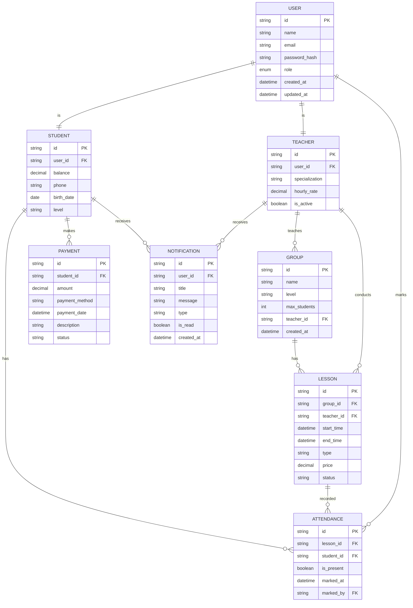

# Бакалаврська робота: Аналіз діаграм для LMS

## Тема та основні deliverables

**Тема:** "Розробка веб-застосунку для управління навчальним центром англійської мови з використанням сучасних frontend технологій"

### Основні deliverables:

1. **Аналітична частина** - аналіз предметної області, вимоги до системи
2. **Проектна частина** - архітектура, дизайн системи, діаграми
3. **Практична частина** - реалізація веб-застосунку на React + TypeScript
4. **Тестова частина** - тестування функціональності
5. **Експлуатаційна частина** - інструкція з розгортання та використання

---

## Альтернативи діаграм для 3 категорій

### 1. Діаграми моделювання бізнес-процесів

#### Варіант 1: BPMN (Business Process Model and Notation)

**Опис:** BPMN - це графічна нотація для моделювання бізнес-процесів, яка забезпечує стандартний спосіб візуального представлення процесів. Використовує специфічні символи для подій, активностей та шлюзів.

**Переваги:**
- Стандартизована нотація (ISO 19510)
- Підтримує як прості, так і складні процеси
- Легко читається бізнес-аналітиками та розробниками
- Можливість автоматичного виконання процесів

**Недоліки:**
- Складна для початківців
- Багато елементів нотації
- Потребує спеціального програмного забезпечення

*Джерело: Object Management Group. Business Process Model and Notation (BPMN) Version 2.0.2. OMG Document Number: formal/2013-12-09.*

#### Варіант 2: IDEF0 (Integration Definition for Function Modeling)

**Опис:** IDEF0 - методологія моделювання функцій, що використовує блоки для представлення функцій та стрілки для показу потоків даних та керування. Фокусується на функціональному розкладанні системи.

**Переваги:**
- Чітка ієрархічна структура
- Добре підходить для аналізу систем
- Стандартизована методологія (FIPS PUB 183)
- Проста для розуміння технічними спеціалістами

**Недоліки:**
- Обмежена для бізнес-процесів
- Менш наочна для складних потоків
- Потребує досвіду в функціональному моделюванні

*Джерело: National Institute of Standards and Technology. IDEF0 Function Modeling Method. NIST Special Publication 800-33.*

---

### 2. Діаграми даних

#### Варіант 1: ER-діаграма (Entity-Relationship Diagram) - нотація Чена

**Опис:** ER-діаграма в нотації Чена використовує прямокутники для сутностей, ромби для зв'язків та овали для атрибутів. Показує логічну структуру даних та взаємозв'язки між сутностями.

**Переваги:**
- Чітке представлення логічної моделі даних
- Стандартизована нотація
- Добре підходить для проектування БД
- Показує кардинальність зв'язків

**Недоліки:**
- Складна для великих систем
- Не показує фізичну реалізацію
- Може бути перевантажена деталями

*Джерело: Chen, P. P. The Entity-Relationship Model. ACM Transactions on Database Systems, 1976, 1(1), 9-36.*

#### Варіант 2: Schema diagram (реляційна схема)

**Опис:** Schema diagram показує фізичну структуру бази даних з таблицями, колонками, ключами та зв'язками. Використовує стандартні символи для представлення реляційних об'єктів.

**Переваги:**
- Пряме відображення структури БД
- Легко реалізується в SQL
- Показує типи даних та обмеження
- Зрозуміла для розробників БД

**Недоліки:**
- Менш абстрактна ніж ER
- Не показує бізнес-логіку
- Складна для нормалізації

*Джерело: Codd, E. F. The Relational Model for Database Management. Morgan Kaufmann, 1990.*

---

### 3. Діаграми поведінки та взаємодії

#### Варіант 1: Sequence Diagram (UML 2.5)

**Опис:** Sequence diagram показує взаємодію об'єктів у часі. Використовує вертикальні лінії життя (lifelines) та горизонтальні стрілки для повідомлень між об'єктами.

**Переваги:**
- Чітко показує послідовність дій
- Візуалізує час виконання
- Добре для API та системних взаємодій
- Стандартизована UML нотація

**Недоліки:**
- Складна для великих систем
- Не показує паралельні процеси
- Потребує точного визначення часу

*Джерело: Object Management Group. Unified Modeling Language (UML) Specification Version 2.5. OMG Document Number: formal/2015-03-01.*

#### Варіант 2: Activity Diagram (UML 2.5)

**Опис:** Activity diagram моделює потік дій та умов переходів. Використовує округлені прямокутники для дій, ромби для рішень та стрілки для потоків.

**Переваги:**
- Подібна до flowchart
- Показує паралельні процеси
- Підтримує умовні переходи
- Легко читається нетехнічними користувачами

**Недоліки:**
- Може бути складною для складної логіки
- Не показує час виконання
- Обмежена для системних взаємодій

*Джерело: Object Management Group. Unified Modeling Language (UML) Specification Version 2.5. OMG Document Number: formal/2015-03-01.*

---

## Обрані діаграми та реалізація

### Обрання діаграм:

1. **BPMN** для бізнес-процесів - найкраще підходить для моделювання робочих процесів навчального центру
2. **ER-діаграма (нотація Чена)** для даних - чітко показує логічну структуру даних LMS
3. **Sequence Diagram** для поведінки - ідеально для моделювання взаємодії компонентів в SPA

---

## Реалізована діаграма: ER-діаграма LMS в нотації Чена

### Опис ER-діаграми LMS

**Основні сутності:**

1. **USER** - базова сутність для всіх користувачів системи
   - Атрибути: id, name, email, password_hash, role, timestamps
   - Роль визначає тип користувача (admin, teacher, student)

2. **STUDENT** - розширює USER для студентів
   - Атрибути: balance, phone, birth_date, level
   - Зв'язок з USER (1:1)

3. **TEACHER** - розширює USER для викладачів
   - Атрибути: specialization, hourly_rate, is_active
   - Зв'язок з USER (1:1)

4. **GROUP** - навчальні групи
   - Атрибути: name, level, max_students
   - Зв'язок з TEACHER (N:1)

5. **LESSON** - заняття/уроки
   - Атрибути: start_time, end_time, type, price, status
   - Зв'язки з GROUP, TEACHER

6. **ATTENDANCE** - відвідуваність
   - Атрибути: is_present, marked_at, marked_by
   - Зв'язки з LESSON, STUDENT, USER

7. **PAYMENT** - платежі
   - Атрибути: amount, payment_method, payment_date
   - Зв'язок з STUDENT

8. **NOTIFICATION** - сповіщення
   - Атрибути: title, message, type, is_read
   - Зв'язок з USER

**Типи зв'язків:**
- ||--|| (один до одного) - USER-STUDENT, USER-TEACHER
- ||--o{ (один до багатьох) - TEACHER-GROUP, GROUP-LESSON
- ||--o{ (один до багатьох) - LESSON-ATTENDANCE, STUDENT-PAYMENT

**Кардинальність:**
- Кожен студент має один запис USER
- Кожен викладач може вести багато груп
- Кожне заняття належить одній групі
- Кожен студент може мати багато платежів

---

## Список літератури

1. Object Management Group. Business Process Model and Notation (BPMN) Version 2.0.2. OMG Document Number: formal/2013-12-09, 2013. 538 p.

2. National Institute of Standards and Technology. IDEF0 Function Modeling Method. NIST Special Publication 800-33, 1993. 78 p.

3. Chen P. P. The Entity-Relationship Model // ACM Transactions on Database Systems. 1976. Vol. 1, No. 1. P. 9-36.

4. Codd E. F. The Relational Model for Database Management. Morgan Kaufmann, 1990. 438 p.

5. Object Management Group. Unified Modeling Language (UML) Specification Version 2.5. OMG Document Number: formal/2015-03-01, 2015. 796 p.
